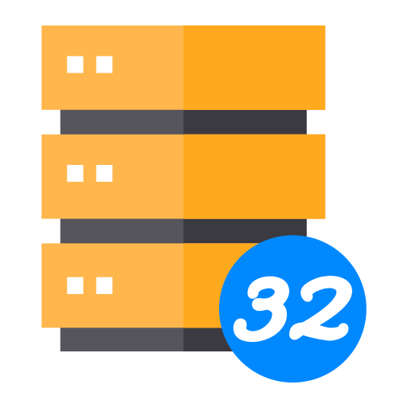

#  SQL32   

O **SQL32** é um projeto desenvolvido em **Delphi 7** com o objetivo de **auxiliar na realização de testes em consultas SQL** em **sistemas legados**.

## Propósito

- O SQL32 **não é um SGBD** (Sistema de Gerenciamento de Banco de Dados).  
- Sua função é **facilitar a execução e teste de queries** durante o desenvolvimento e manutenção de sistemas antigos.  
- O projeto foi criado **exclusivamente para auxiliar em projetos legados**.  

## Observações

- Uso destinado apenas para **cenários de manutenção de sistemas antigos**.  
- Não recomendado para projetos novos.  
